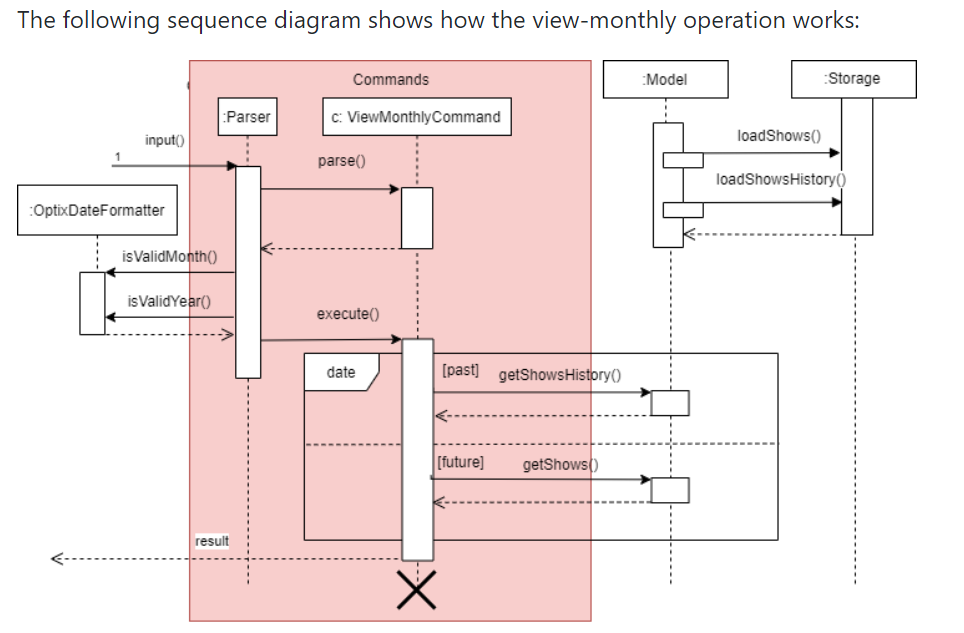
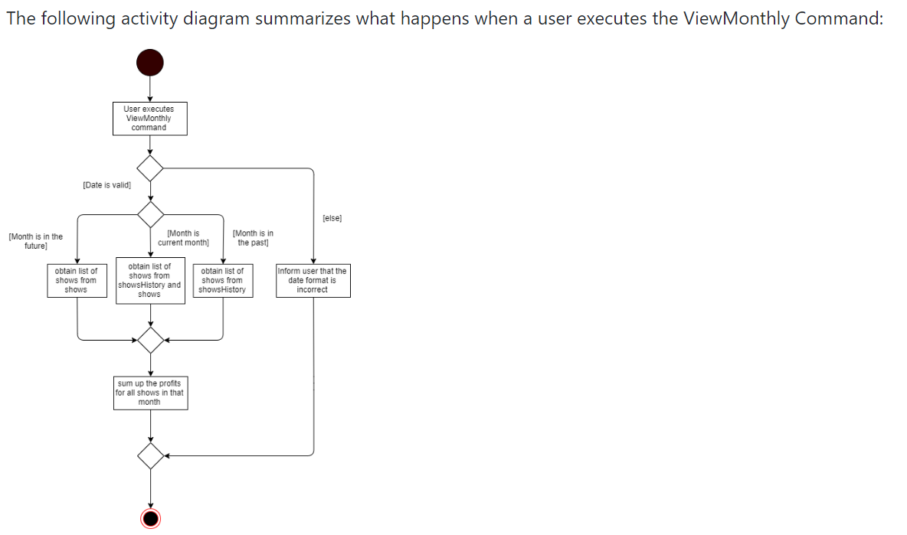

*Liu Wei Jie Nicholas* -- Project Portfolio for Optix

== About the project
My team is a group of 4 Computer Engineering Students. My team and I were tasked to  enhance a basic command line
interface(CLI) desktop Duke application while retaining the CLI feature for our Software Engineering Project.
We agreed on morphing it into a seat booking cum finance managing system for a venue such as a theatre. Our product,
Optix, allows users like theatre managers to track seat booking of a show as well as the finances from the bookings.

A snapshot of our product is as shown:

Figure 1: The Graphical User Interface for Optix

My role was to implement the code for the commands dealing with the `finance` features. The following sections
further elaborate on my enhancements as well as on my contributions to the user and developer guide.

The following symbols are used in this document: +
`view-profit` Grey highlighted components indicate that this is a command that can be entered into
the command line of Optix.

== Summary of contributions
This sections summarizes my coding, documentation and other contributions made to the team's progress.

=== Enhancements added
. Command to view the profit earned from a single show and from a particular month.

.. What it does: The `view-profit` command allows the user to view the profit earned from selling the seats
of one show. The `view-monthly` command allows the user to view monthly profits.

.. Justification: The primary goal of businesses is to generate profit. The managers would want to view the
profits earned from the shows so that they can calculate the returns from their business. Viewing the profits
of the shows would also give the users like managers an idea of how popular this particular show is, and adopt
policies to further increase their profits. For example, knowing that a particular show is constantly sold out,
theatre managers can screen more of that show on other dates to raise the revenue earned. Knowing the profits
earned every month would also allow the business to evaluate their current business strategy and make relevant
improvements. Viewing the monthly profits would also allow the business to calculate the revenue earned from all
shows in that month instead of adding the revenue from individual shows one by one.

.. Highlights: This enhancement affects commands to be added in future, such as viewing profits for multiple
shows or dates at once. The implementation was also challenging as much analysis and consideration need to be
made to decide on the most appropriate date structure to retrieve the particular show from the list. This is
crucial as other features also depend on this data structure which would affect the efficiency of the program.

. Command to re-assign the seats of customers.

.. What it does: The `re-assign` command allows the user to change the seat booking of a customer to
another seat.

.. Justification: Customers may have booked the wrong seat or mistakes might be made by the managing personnel
when booking the seats. The `re-assign` command would also allow customers to upgrade or downgrade their seat
since the prices of seats are based on the different tiers.

.. Highlights: This enhancement goes hand-in-hand with other features and commands to be added in future. Refunding
seats would require certain methods implemented by `re-assign` command. In addition, re-assign also implements certain
features of other finance commands as the cost difference between the changed seats have to be accounted for.

*Code contributed*: Please click the link below to see a sample of my code:
link:https://nuscs2113-ay1920s1.github.io/dashboard/#search=NicholasLiu97&sort=groupTitle&sortWithin=title&since=2019-09-21&timeframe=commit&mergegroup=false&groupSelect=groupByRepos&breakdown=false&tabOpen=true&tabType=authorship&tabAuthor=NicholasLiu97&tabRepo=AY1920S1-CS2113T-T12-1%2Fmain%5Bmaster%5D[Functional code]

=== Other contributions:
* Project management:
** There were a total of 3 releases, from version mid v1.1 to v1.3 as of current date. I managed releases versions
1.2 and 1.3 (2 releases) on GitHub.
** I was also in charge of ensuring that weekly increments were delivered on time.
*Enhancements to existing features:
** Wrote test cases to increase test coverage. 
* Documentation:
** Implemented the layout of the User Guide and Developer Guide on github.
** Added further explanations to existing features for further clarification. (Done on google docs)
** Made cosmetic improvements to the User Guide to make it more user-friendly.
* Community:
** Reviewed Pull Requests: #12, #13, #21, #68, #69, #78, #102
** Offered suggestions to team members to refactor some parts of the code for tidier
implementation.

== Contributions to the User Guide
Updates to the User Guide were made for every new feature added. In addition, the User Guide is constantly
refined weekly to increase readability and make it more user friendly.
The sections below show the contributions I made to the User Guide.

=== Formatting of User Guide
I laid out the style and structure of the user guide, which was then refined together with my teammates.
The UserGuide was built to be more user friendly in the form of navigation, where I labelled the headings and
subheadings of the various sections and included a content page. Additionally, the content page allowed users to
easily navigate to the appropriate sections by clicking on them. The current layout of the User Guide is adopted from
the sample link:https://github.com/nusCS2113-AY1920S1/addressbook-level3/blob/master/docs/UserGuide.adoc[User Guide]
provided in addressbook-level3.
A glimpse of the content page is shown below:

Figure 2: Content page

By clicking any of the sections in the content page as shown in Figure 2, the User Guide will automatically
navigate to that section so the user will not have to keep scrolling to search for

The edits made to the format of the user guide can be seen in pull request
link:https://github.com/AY1920S1-CS2113T-T12-1/main/pull/108/commits/7f22b34db1e3eafe514c0f99b6217057ffbc1daf[#108]

=== Finance features of the User Guide
After completing the code for the finance features, I updated the user guide with step-by-step
instructions on how to implement the commands. The figures show snippets of the user guide that
contains the instructions on the finance features I implemented.

Figure 3: UG Finance feature pt1

Figure 4: UG Finance feature pt2

Figure 5: UG Finance feature pt3

Figure 6: UG Finance feature pt4

As shown in Figures 3 to 4, the instructions for the `view-profit` and `view-monthly` command
were thoroughly explained. Examples of the use of the commands were also given as shown in
Figures 3 and 4. In Figure 1, a tip for the user was also included to make the guide more user
friendly as well as inform them of shortcuts that can be used for more efficiency.

I also included images of the GUI in Figures 5 and 6 to show the users the expected outcome when
inputting the commands through the CLI. This would further enhance their understanding of how Optix
will interact with them when they carry out these commands.

== Contributions to the Developer Guide
Updates to the Developer Guide were made for every new feature added. The Developer Guide is also constantly
refined weekly to increase readability and make it more user friendly.
The sections below show the contributions I made to the Developer Guide.

=== Finance features of the Developer Guide
The following figures contain snippets of the developer guide which explain my implementation of the
finance features.

Figure 7: DG Finance feature pt1

Figure 8: DG Finance feature pt2

Figure 9: DG Finance feature pt3

Figure 10: DG Finance feature pt4

As shown in Figure 7, I listed the key methods used by the `view-monthly` command. This would
be essential for other developers as they contain information on how the different classes
are connected to each other and which classes the methods belong to. The methods listed would
also let developers know what all the methods `view-monthly` command is implementing and can
skip this section if these methods do not contain what they are looking for. In addition,
developers can add on to the code if they know the overall `view-monthly` class is missing
certain methods.

Figures 7, 8 and 9 also explain the logic behind the implementation of `view-monthly` command.
Figures 8 and 9 contain the sequence and activity diagrams respectively, which gives developers
a visual representation of the logic. By combining text and visual aids, developers would be able
to grasp the implementation more easily and hence have an easier time following the implemented
logic when they are adding enhancements.

Figure 10 contains the design considerations I included in the Developer Guide. This section would
allow other developers understand my thought process when implementing the `view-monthly` command
and why I used certain methods over others. As other developers do not know the entire code,
my design considerations would allow them to understand the more efficient ways to further develop
other features accustomed to the entire product.

== Conclusion
This product portfolio summarises the contributions I have made to the project. The contributions I made
in the code were mostly finance related, which is one of the main selling points of Optix. I also tried
to ensure the User Guide and Developer Guide were easy to navigate and understand so that users do
not have to refer to these guides again after going through minimal number of times. It is my goal to
further enhance the code or any of the guides as much as possible to avoid time wastage.

